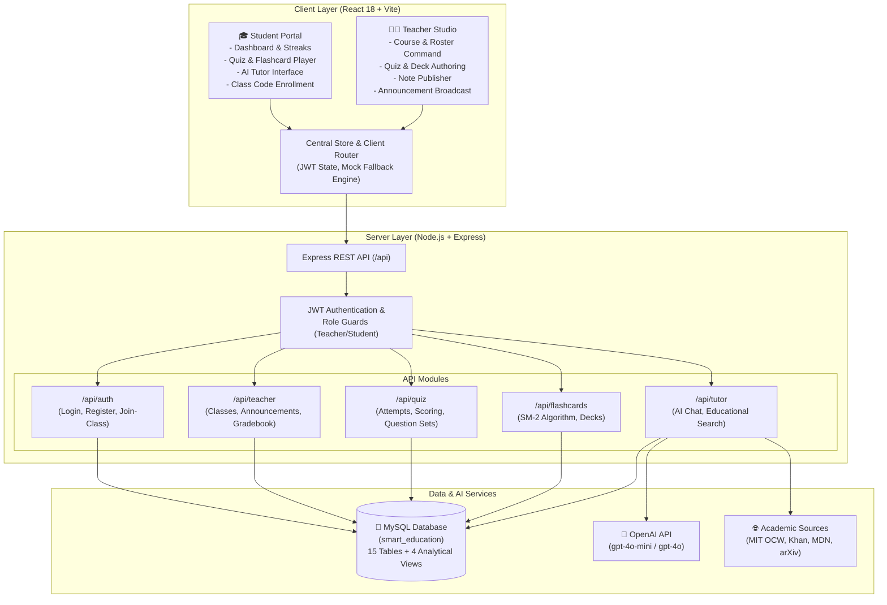
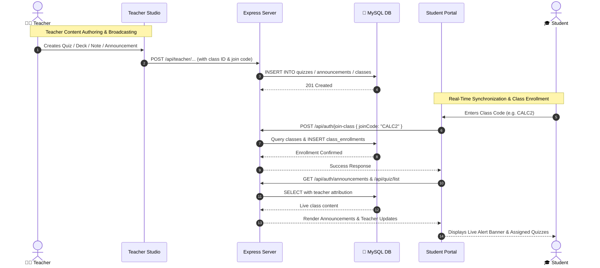
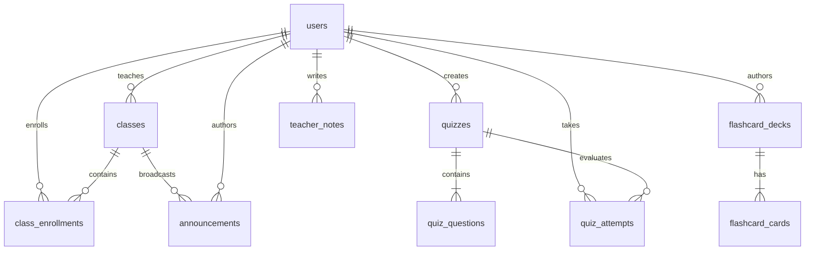

# Smart Education Starter Kit — Next-Gen AI Learning Platform 🎓🤖

An intelligent, full-featured educational platform built with **React**, **Vite**, **OpenAI ChatGPT**, and dynamic **Automated Web Reference Gathering**. Designed for both students and teachers, featuring interactive AI tutoring, spaced repetition flashcards, adaptive quizzes, dynamic study schedules, and classroom management.

---

## 📑 Table of Contents

- [Overview](#-overview)
- [Architecture & Tech Stack](#-architecture--tech-stack)
  - [System Architecture Diagram](#system-architecture-diagram)
  - [Teacher-to-Student Synchronization Flow](#teacher-to-student-synchronization-flow)
- [Key Modules & Features](#-key-modules--features)
  - [1. AI Tutor & Research Engine](#1-ai-tutor--research-engine)
  - [2. Spaced Repetition Flashcards](#2-spaced-repetition-flashcards)
  - [3. Adaptive Quiz Engine](#3-adaptive-quiz-engine)
  - [4. Dynamic Study Plan Generator](#4-dynamic-study-plan-generator)
  - [5. Teacher Studio & Command Center](#5-teacher-studio--command-center)
  - [6. Student Portal & Academic Experience](#6-student-portal--academic-experience)
- [Project Directory Structure](#-project-directory-structure)
- [Getting Started](#-getting-started)
  - [Prerequisites](#prerequisites)
  - [Installation](#installation)
  - [Environment Configuration](#environment-configuration)
  - [Running the App](#running-the-app)
- [API & Service Architecture](#-api--service-architecture)
  - [API Endpoints Overview](#api-endpoints-overview)
  - [Offline Simulation Fallback](#offline-simulation-fallback)
- [Security Best Practices](#-security-best-practices)
- [Contributing](#-contributing)
- [License](#-license)

---

## 🌟 Overview

The **Smart Education Starter Kit** bridges modern pedagogical design with generative AI. It gives students personalized one-on-one tutoring with cited academic literature from top universities and educational repositories, while giving educators tools to author quizzes, publish notes, and manage flashcard decks.

The application is engineered to work in two modes:

1. **Full-Stack Live Mode**: Connects to an OpenAI API key (or backend API) for real-time ChatGPT responses and live data storage.
2. **Standalone Offline Mode**: If no API key or backend is available, the built-in mock simulation engine responds instantly with rich educational data, sample classes, flashcard decks, and pre-gathered web citations with zero network errors.

---

## 🛠 Architecture & Tech Stack

- **Frontend Framework**: React 18 with modern functional components and hooks
- **Build Tool & Dev Server**: [Vite](https://vitejs.dev/) with lightning-fast Hot Module Replacement (HMR)
- **Backend Framework**: [Express.js](https://expressjs.com/) REST API server with modular route architecture
- **Database**: [MySQL](https://www.mysql.com/) with `mysql2` driver, connection pooling, and auto-migration
- **Authentication**: JWT (JSON Web Tokens) with `bcryptjs` password hashing
- **AI Engine**: OpenAI API (`gpt-4o-mini` / `gpt-4o`) with pedagogical system prompts (server-side proxying)
- **Web Reference Gathering**: Automated academic source extraction engine (MIT OCW, Stanford CS, Khan Academy, MDN, arXiv, Wolfram)
- **State Management**: Reactive observer-based centralized store ([`src/state/store.js`](file:///d:/Semester%205/smart-education-starter/src/state/store.js)) with subscriber hooks
- **Routing**: Client-side history routing with browser-compatible navigation ([`src/router.js`](file:///d:/Semester%205/smart-education-starter/src/router.js))
- **Design System**: Vanilla CSS tokens, glassmorphism, responsive grid & flexbox layouts, micro-animations, and modern typography

### System Architecture Diagram



### Teacher-to-Student Synchronization Flow



---

## 🚀 Key Modules & Features

### 1. AI Tutor & Research Engine

- **ChatGPT Integration**: Real-time conversational tutoring powered by `gpt-4o-mini`, tailored to the selected subject (Computer Science, Mathematics, Science, Humanities).
- **Web Reference Gathering Engine**: Whenever a question is asked, the system searches and indexes verified academic materials:
  - *Computer Science*: MIT OpenCourseWare, Stanford CS, MDN Web Docs, React Docs, GeeksforGeeks.
  - *Mathematics*: Khan Academy, MIT 18.01 Single Variable Calculus, Wolfram MathWorld.
  - *Sciences*: Nature Scitable, NCBI Bookshelf, Khan Academy Physics & Chemistry.
  - *Scholarly Literature*: arXiv.org e-Print Archive, Wikipedia Open Knowledge.
- **Interactive References Drawer**: Expandable source drawer beneath AI messages with source badges, direct links, and one-click citation copy.
- **Reference Hub**: In-session modal collecting all citations generated across the conversation for bibliography export.
- **Interactive Code Sandbox**: Modal inside the tutor for writing, testing, resetting, and copying programming snippets in real time.
- **Voice Input Support**: Speech-to-text integration for asking tutoring questions hands-free.

### 2. Spaced Repetition Flashcards

- **3D Card Flip Animation**: Smooth CSS transform-based flip interactions with question, answer, and optional hint.
- **Spaced Repetition Ratings**: Categorize retention with *Easy*, *Medium*, or *Hard* buttons to dynamically recalculate mastery scores.
- **PDF Slide Extraction**: Upload lecture slides or PDF notes to parse and auto-generate flashcard decks.
- **Teacher Deck Builder**: Comprehensive interface for teachers to create new decks, add card pairs with hints, and publish to class rosters.

### 3. Adaptive Quiz Engine

- **Timed Assessments**: Configurable question countdown timer and total exam clock.
- **Dynamic Question Formats**: Multiple choice, true/false, and short answer formats.
- **Instant Answer Verification**: Clear visual indicators for correct and incorrect answers with detailed pedagogical rationales.
- **Performance Analytics**: Score breakdown percentages, earned mastery badges, and retry options.
- **Teacher Quiz Builder**: Form interface to set quiz titles, target subjects, passing thresholds, time limits, and custom questions with answer explanations.

### 4. Dynamic Study Plan Generator

- **Personalized Schedule Generator**: Form-driven schedule builder that accepts target exam date, weekly available study hours, and subject difficulty rating.
- **Interactive Timeline**: Weekly breakdown of milestones, required readings, and practice problems.
- **Task Progress Tracking**: Interactive checkboxes with dynamic progress percentage calculations saved locally.

### 5. Teacher Studio & Command Center

- **Dedicated Teacher Experience**: Specialized navigation bar, class switcher, and role-guarded routes (`/teacher`).
- **Class Join Codes**: Every class features a unique short invite code (e.g., `CALC2`, `CS101`, `PY100`) with one-click clipboard copying.
- **Broadcast Announcements**: Publish instant class bulletins or school-wide alerts with priorities (`normal`, `important`, `urgent`) directly synced to student feeds.
- **Interactive Note Editor**: Create, format, tag, and publish class lecture notes.
- **Student Roster & Gradebook**: Track individual student performance, quiz scores, and flashcard mastery matrix.
- **Quick Action Hub**: Direct shortcuts to launch the Quiz Builder, Flashcard Deck Builder, and AI Lesson Plan Generator.

### 6. Student Portal & Academic Experience

- **Dedicated Student Experience**: Focused student workspace (`/`, `/quiz`, `/flashcards`, `/tutor`, `/study-plan`).
- **Join Class by Code**: Modal dialog allowing students to enter an instructor's join code to enroll in classes instantly.
- **Live Teacher Updates Feed**: Highlights teacher-assigned quizzes, flashcard decks, and notes with instructor badges.
- **Class Announcement Banner**: Real-time broadcast alerts from enrolled courses.
- **AI Tutor Prompt Chips & Syntax Blocks**: Quick prompt starters and syntax code blocks with one-click copy buttons.
- **Streak & Gamification**: Daily XP progress tracker, fire streak counter, and level badges.

---

## 📁 Project Directory Structure

```text
smart-education-starter/
├── public/                     # Static HTML & assets
│   └── index.html              # HTML entry point
├── server/                     # ⭐ Express + MySQL Backend
│   ├── db/
│   │   ├── connection.js       # MySQL2 connection pool
│   │   ├── schema.sql          # DDL for all 15 tables
│   │   └── init.js             # Auto-create DB, tables & seed data
│   ├── middleware/
│   │   └── auth.js             # JWT verification & role guards
│   ├── routes/
│   │   ├── auth.js             # Register, login, profile CRUD
│   │   ├── flashcards.js       # Deck/card CRUD, SM-2 spaced repetition
│   │   ├── quiz.js             # Quiz lifecycle & scoring
│   │   ├── studyPlan.js        # Plan generation & milestone tracking
│   │   ├── teacher.js          # Classes, notes, analytics
│   │   └── tutor.js            # AI chat & web references
│   ├── .env                    # Backend environment variables
│   ├── .env.example            # Backend env template
│   ├── index.js                # Express entry point
│   └── package.json            # Backend dependencies
├── src/
│   ├── components/             # Reusable modular UI components
│   │   ├── common/             # Button, Card, Modal, Navbar
│   │   │   ├── Button.jsx
│   │   │   ├── Card.jsx
│   │   │   ├── Modal.jsx
│   │   │   └── Navbar.jsx
│   │   ├── flashcards/         # Flashcard viewer & PDF parser
│   │   │   ├── FlashcardViewer.jsx
│   │   │   └── PdfUpload.jsx
│   │   ├── quiz/               # Interactive quiz window
│   │   │   └── QuizWindow.jsx
│   │   ├── studyPlan/          # Generator & timeline components
│   │   │   ├── PlanGenerator.jsx
│   │   │   └── PlanTimeline.jsx
│   │   ├── teacher/            # Teacher authoring tools
│   │   │   ├── FlashcardDeckBuilder.jsx
│   │   │   ├── NoteEditor.jsx
│   │   │   └── QuizBuilder.jsx
│   │   └── tutor/              # AI Tutor interface
│   │       ├── ChatWindow.jsx
│   │       ├── CodeSandboxModal.jsx
│   │       └── WebReferencesDrawer.jsx
│   ├── pages/                  # Top-level page views
│   │   ├── FlashcardsPage.jsx
│   │   ├── LoginPage.jsx
│   │   ├── ProfilePage.jsx
│   │   ├── QuizPage.jsx
│   │   ├── StudentDashboard.jsx
│   │   ├── StudyPlanPage.jsx
│   │   ├── TeacherDashboard.jsx
│   │   └── TutorPage.jsx
│   ├── services/               # Centralized HTTP and AI services
│   │   ├── api.js              # HTTP client, interceptors & mock fallback
│   │   ├── authService.js      # Login, registration, token persistence
│   │   ├── flashcardService.js # Deck retrieval & submission
│   │   ├── openaiService.js    # OpenAI ChatGPT direct completions
│   │   ├── quizService.js      # Quiz start, answer evaluation, results
│   │   ├── studyPlanService.js # Study plan generation & updates
│   │   ├── teacherService.js   # Classes, student notes, analytics
│   │   └── tutorService.js     # Chat messages & web reference queries
│   ├── state/
│   │   └── store.js            # Reactive application store
│   ├── styles/                 # Modular CSS architecture
│   │   ├── flashcards.css
│   │   ├── global.css
│   │   ├── tutor.css
│   │   └── variables.css
│   ├── utils/
│   │   └── h.js                # Lightweight DOM helper
│   ├── App.jsx                 # Application root & view switcher
│   ├── main.jsx                # Vite React root mount
│   └── router.js               # Route paths & navigation helpers
├── .env.example                # Environment variables template
├── .gitignore                  # Git ignore rules (secrets & node_modules)
├── package.json                # Frontend dependencies and npm scripts
├── README.md                   # Complete platform documentation
└── vite.config.js              # Vite bundler config (with /api proxy)
```

---

## 🏁 Getting Started

### Prerequisites

- [Node.js](https://nodejs.org/) (version 16 or higher)
- [npm](https://www.npmjs.com/) (version 8 or higher)
- [MySQL](https://www.mysql.com/) (version 8.0 or higher) — installed and running on port `3306`
- (Optional) An OpenAI API key from [platform.openai.com](https://platform.openai.com/)

### Installation

1. Clone the repository to your local machine:

   ```bash
   git clone https://github.com/roshinrg/smart-education-starter.git
   cd smart-education-starter
   ```

2. Install frontend dependencies:

   ```bash
   npm install
   ```

3. Install backend dependencies:

   ```bash
   cd server
   npm install
   cd ..
   ```

### Environment Configuration

Create a `.env` file in the root directory by copying `.env.example`:

```bash
cp .env.example .env
```

Open `.env` and fill in your configuration:

```env
# API Configuration
API_BASE_URL=http://localhost:5000/api

# Feature Flags
ENABLE_ANALYTICS=true
ENABLE_NOTIFICATIONS=true

# OpenAI / ChatGPT Direct Access (Frontend Standalone Mode)
VITE_OPENAI_API_KEY=your_openai_api_key_here
VITE_OPENAI_MODEL=gpt-4o-mini
```

Also configure the backend environment — create `server/.env` by copying `server/.env.example`:

```env
# Server Port
PORT=5000

# MySQL Database
DB_HOST=localhost
DB_PORT=3306
DB_USER=root
DB_PASSWORD=your_mysql_password
DB_NAME=smart_education

# JWT Secret
JWT_SECRET=your_jwt_secret_here

# OpenAI (optional — for AI tutor)
OPENAI_API_KEY=your_openai_api_key_here
OPENAI_MODEL=gpt-4o-mini
```

> **Security Reminder**: Never commit your `.env` file to Git! It contains your private keys. The `.gitignore` file is already preconfigured to protect `.env`.

### Connecting with MySQL Workbench 🐬

You can easily inspect, query, and manage the database using [MySQL Workbench](https://www.mysql.com/products/workbench/):

1. Open **MySQL Workbench** and click the **`+`** icon next to **MySQL Connections**.
2. Fill in the connection settings:
   - **Connection Name**: `Smart Education`
   - **Connection Method**: `Standard (TCP/IP)`
   - **Hostname**: `127.0.0.1`
   - **Port**: `3306`
   - **Username**: `root`
   - **Password**: Click **Store in Vault ...** and enter your MySQL root password (e.g. `2206`)
   - **Default Schema**: `smart_education`
3. Click **Test Connection** to confirm connectivity, then click **OK**.
4. Double-click the connection tile to open the SQL editor.
5. In the left sidebar under `smart_education`:
   - **Tables**: Browse all 15 relational tables (`users`, `classes`, `quizzes`, `flashcards`, etc.)
   - **Views**: Inspect analytical views (`v_student_performance`, `v_class_summary`, `v_quiz_overview`, `v_deck_summary`)

#### Database Entity Relationship Diagram



### Running the App

To run the complete full-stack application, you will run both the **Backend** and the **Frontend** in two separate terminal windows:

#### Terminal 1 — Start the Backend (Port 5000)

From the project root:

```bash
npm run server
```

*(Alternatively: `cd server && npm run dev`)*

On startup, the backend server will:

- Connect to MySQL on port `3306`
- Automatically create the `smart_education` database if it doesn't exist
- Create all 15 relational tables via schema migration
- Seed demo data (demo student & teacher accounts, flashcard decks, quizzes, notes)
- Listen on `http://localhost:5000` (API status at `http://localhost:5000/api/health`)

#### Terminal 2 — Start the Frontend UI (Port 5173)

From the project root:

```bash
npm run dev
```

Open **`http://localhost:5173`** in your browser to access the application UI. The Vite dev server automatically proxies all `/api` requests to the backend on port `5000`.

---

### Application URLs & Ports Summary

| Component | URL | Description |
| :--- | :--- | :--- |
| **Frontend Web App** | [`http://localhost:5173`](http://localhost:5173) | Interactive student & teacher web portal (React + Vite) |
| **Backend API Root** | [`http://localhost:5000`](http://localhost:5000) | Server info & API status |
| **API Health Check** | [`http://localhost:5000/api/health`](http://localhost:5000/api/health) | Backend health monitoring endpoint (`{ status: "ok" }`) |

---

### Demo Accounts

Use these pre-seeded accounts to log in on `http://localhost:5173`:

| Role | Email | Password | Access & Features |
| :--- | :--- | :--- | :--- |
| **Student** | `demo@smartedu.com` | `password123` | Student dashboard, AI tutor chat, flashcards, study plans, quizzes |
| **Teacher** | `teacher@edu.com` | `password123` | Teacher dashboard, classroom analytics, quiz builder, note editor, deck studio |

> **Graceful Fallback / Offline Mode**: If MySQL or the backend is ever stopped, the frontend automatically falls back to its built-in mock simulation engine so you can continue demonstrating or testing UI components seamlessly.

---

### Production Build

To compile and bundle the frontend for production:

```bash
npm run build
```

To preview the production build locally:

```bash
npm run preview
```

---

## 📡 API & Service Architecture

### API Endpoints Overview

The frontend communicates through standardized services in [`src/services/`](file:///d:/Semester%205/smart-education-starter/src/services/):

| Service | Endpoint | Method | Purpose |
| :--- | :--- | :--- | :--- |
| **Auth** | `/auth/login` | `POST` | User login (returns JWT token and profile) |
| **Auth** | `/auth/register` | `POST` | New student / teacher registration |
| **Auth** | `/auth/profile` | `GET` / `PUT` | Read and update user profile data |
| **Tutor** | `/tutor/chat/message` | `POST` | Send prompt to AI Tutor and retrieve citations |
| **Tutor** | `/tutor/web-references` | `POST` | Query educational references across subjects |
| **Tutor** | `/tutor/chat/:id` | `GET` | Retrieve historical chat sessions |
| **Flashcards** | `/flashcards/decks` | `GET` | List available flashcard decks |
| **Flashcards** | `/flashcards/deck/:id` | `GET` | Retrieve cards for a specific deck |
| **Flashcards** | `/flashcards/generate` | `POST` | Generate cards from uploaded notes/PDFs |
| **Flashcards** | `/flashcards/response` | `POST` | Record student card mastery rating |
| **Quiz** | `/quiz/start` | `POST` | Begin an adaptive quiz session |
| **Quiz** | `/quiz/answer` | `POST` | Submit question answer and receive explanation |
| **Quiz** | `/quiz/results/:id` | `GET` | Fetch final quiz score and performance badges |
| **Study Plan** | `/study-plan/generate` | `POST` | Generate custom multi-week study timeline |
| **Study Plan** | `/study-plan/progress` | `GET` | Retrieve student study milestones |
| **Teacher** | `/teacher/classes` | `GET` | List active courses and student metrics |
| **Teacher** | `/teacher/notes` | `GET` / `POST` | View and publish lecture notes |
| **Teacher** | `/teacher/analytics` | `GET` | Class performance and mastery analytics |

### Offline Simulation Fallback

When developing without a backend server running on `http://localhost:5000`, the centralized [`src/services/api.js`](file:///d:/Semester%205/smart-education-starter/src/services/api.js) client automatically detects the environment and returns rich, contextual mock responses with zero `net::ERR_CONNECTION_REFUSED` errors:

- If `VITE_OPENAI_API_KEY` is supplied, the tutor directly queries **OpenAI ChatGPT** while attaching gathered web references.
- If no key is set, the tutor uses an educational generator that provides thorough explanations alongside authentic web references.

---

## 🔒 Security Best Practices

1. **Keep Keys Private**: Keep your `OPENAI_API_KEY` and `VITE_OPENAI_API_KEY` in `.env`.
2. **Use Template Files**: Share `.env.example` with placeholders so teammates can configure their own environments without exposing secrets.
3. **Frontend Key Precaution**: When using `VITE_OPENAI_API_KEY` in public client bundles, restrict your OpenAI API key to specific HTTP referrers or budget caps in your OpenAI dashboard.

---

## 🤝 Contributing

We welcome contributions to make the Smart Education platform even better!

1. Fork the Project repository

2. Create your Feature Branch:

   ```bash
   git checkout -b feature/NewFeature
   ```

3. Commit your Changes:

   ```bash
   git commit -m "feat: add interactive code execution for Python"
   ```

4. Push to the Branch:

   ```bash
   git push origin feature/NewFeature
   ```

5. Open a Pull Request

---

## 📄 License

Distributed under the **MIT License**. See `LICENSE` for more details.

---

### Happy Learning! 🎓
